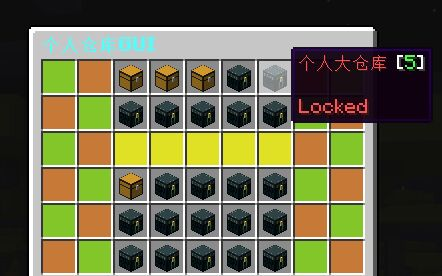
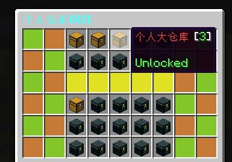
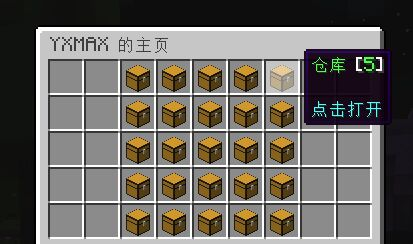
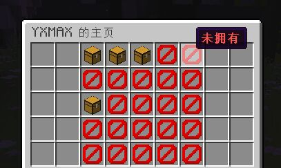
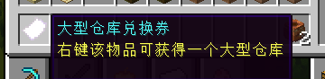

# PlayerInv
## 🛠 Plugin Dependencies
+ Vault [Download](https://www.spigotmc.org/resources/vault.34315/)

## 🛠 Plugin Versions
* If you need version below 1.13, click me to download
* zh-CN version: [MineBBS Forum](https://www.minebbs.com/resources/playerinv-1-12-x-1-20-x.7117/)
* en-US version: Github Releases
## ✨ Plugin Features

* Supported Version 1.12.X-1.20.X
* Supported Spigot,PaperSpigot,CatServer,Folia,Arclight,Purpur
* Supported MySQL,SQLite
* Highly customizable GUI
* Supported use vouchers to get vault
* Use ItemSwapItem Key(Default F) to open Main GUI
* Supported KeyOpen Toggle
* Supported check vault when player offline or online (OP)
* Supported change vault when player offline or online (OP)
* Base64 Code to storge Inventory, High Security
* Two diffent vault: tiny vault(27 sizes), large vault(54 sizes)
* 10 large vaults, 15 tiny vaults

## ✨ Plugin Pictures

## 📃 License
[Apache License v2.0](https://www.apache.org/licenses/LICENSE-2.0.html)
